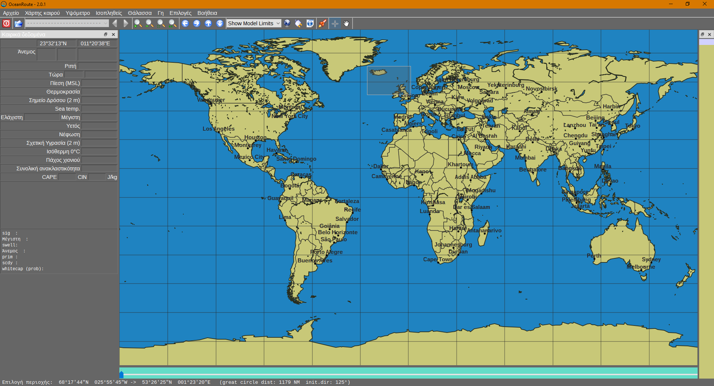

# Ocean-Route - Weather Map & Forecast Visualization



## Build Guide & Changelog

1. Install Qt and QtCreator. Select MinGW compiler, CMake and Ninja during the installation process as well.  
	- Tested on Qt 5.15.0 32-bit with MinGW 8.1.0 32-bit
2. Use the "Open" command of QtCreator and select CMakeLists.txt  
3. Link the libraries, can be done by adding the following lines to CMakeLists.txt  
 set(BZIP2_INCLUDE_DIR "${CMAKE_CURRENT_SOURCE_DIR}/include")  
 set(BZIP2_LIBRARIES "${CMAKE_CURRENT_SOURCE_DIR}/lib/libbz2.a")  
 set(LIBNOVA_INCLUDE_DIR "${CMAKE_CURRENT_SOURCE_DIR}/include")  
 set(LIBNOVA_LIBRARY "${CMAKE_CURRENT_SOURCE_DIR}/lib/libnova.a")  
 set(OPENJPEG_INCLUDE_DIR "${CMAKE_CURRENT_SOURCE_DIR}/include")  
 set(OPENJPEG_LIBRARIES "${CMAKE_CURRENT_SOURCE_DIR}/lib/libopenjp2.dll")  
 set(PNG_INCLUDE_DIR "${CMAKE_CURRENT_SOURCE_DIR}/include")  
 set(PNG_LIBRARIES "${CMAKE_CURRENT_SOURCE_DIR}/lib/libpng.a")  
 set(PROJ4_INCLUDE_DIR "${CMAKE_CURRENT_SOURCE_DIR}/include")  
 set(PROJ4_LIBRARIES "${CMAKE_CURRENT_SOURCE_DIR}/lib/libproj.a")  
 set(ZLIB_INCLUDE_DIR "${CMAKE_CURRENT_SOURCE_DIR}/include")  
 set(ZLIB_LIBRARIES "${CMAKE_CURRENT_SOURCE_DIR}/lib/libz.a")  
4. Build and Compile, the few errors that occur can be easily fixed one by one.  
5. Copy the "/Ocean-Route/data/" folder to the output folder that includes the "Weathergrib.exe" executable.
 
### Task: Change Icon

1. Change icons at "/win_online_installer/".
2. Change three of the icons at "/data/img/".

### Task: Change Application Window Title

1. Change `Version.h.in:line 62`.

### Task: Create an Installer

1. Add repogen.exe and binarycreator.exe to PATH (C:\Qt\Tools\QtInstallerFramework\3.2\bin).
2. Copy the compiled .exe to "/Ocean-Route/win_online_installer/deploy"
3. Run "win-deploy-and-installer.sh".

Alternatively: <http://installsimple.com/>

### Task: Make the .exe file runable in a standalone fashion instead of it only being able to run through Qt

1. Copy all the files inside "/Ocean-Route/standalone_requirements/" to the output folder that includes the "Weathergrib.exe" executable.  

Alternatively follow the detailed steps

1. [Copy all the .dll files from "C:\Qt\5.15.0\mingw81_32\bin" to the folder](https://wiki.qt.io/Deploy_an_Application_on_Windows) (or add to PATH).
2. [Copy all the folders from "C:\Qt\5.15.0\mingw81_32\plugins" to the folder](https://wiki.qt.io/Deploy_an_Application_on_Windows) (or add to PATH).
3. Add libopenjp2.dll to the folder.

### Task: Add even higher resolution maps if file size is not an issue

1. [Download](https://github.com/opengribs/XyGrib/releases/download/v1.1.1/XyGrib___High_Resolution_Maps.tar.gz) and copy.

## General Build & Package Instructions

Generally, build the executable and then run the appropriate .sh file.

### macOS

- Install [Homebrew](https://brew.sh)
- Install the requred packages: `brew tap indilib/indi; brew install git cmake libnova openjpeg libpng qt5 proj`

- Get the source

```
git clone https://github.com/spykard/Weathergrib.git
```

- Build

To build, you'll need to tell CMake where Qt is located. This will be something like ```/usr/local/Cellar/qt/5.8.1``` The exact version number may differ, check the version you have installed.

```
mkdir build
cd build
QT5_DIR="/usr/local/Cellar/qt/5.11.1"
cmake .. -DCMAKE_PREFIX_PATH=$QT5_DIR/
make
```

- Package

```
cd ..
mv build/src/Weathergrib.app .
./mac-package.sh
```

### Linux

- Install the required libraries
  - Ubuntu (recent editions): `sudo apt-get install build-essential git cmake qt5-default libpng-dev libopenjp2-7-dev libnova-dev libproj-dev zlib1g-dev libbz2-dev`
  - Ubuntu Trusty: `sudo apt-get install build-essential git cmake qt5-default libpng-dev libopenjpeg-dev libnova-dev libproj-dev zlib1g-dev libbz2-dev`
  - Fedora 30:
    - Build: `sudo dnf install gcc cmake make qt5-devel libpng-devel openjpeg2-devel libnova-devel proj-devel zlib-devel bzip2-devel`
    - Run: `libnova openjpeg2 qt5-qtbase qt5-qtbase-gui proj`
  - openSUSE Tumbleweed: `sudo zypper install gcc git cmake libqt5-qtbase-devel libpng-devel openjpeg2-devel libnova-devel libproj-devel zlib-devel libbz2-devel
  - NIXOS: [`nixpkgs` contains a package for Weathergrib](https://github.com/NixOS/nixpkgs/tree/master/pkgs/applications/misc/weathergrib)
    - To get a a build environment containing all prerequisities run `nix-shell -p weathergrib`
    - If you simply want to install it, use `nix-env -i weathergrib`

- Get the source

```
git clone https://github.com/spykard/Weathergrib.git
```

- Build

```
git clone https://github.com/spykard/Weathergrib.git
mkdir build
cd build
cmake ..
make
```

- Install

```
cmake -DCMAKE_INSTALL_PREFIX=/wherever ..
sudo make install
```

- Package (For Debian will create one .deb for the app and one .deb for the supplementary maps)

```
dpkg-buildpackage -b
```

### Windows

- Get the source

```
git clone https://github.com/spykard/Weathergrib.git
```

- Build

```
git clone https://github.com/spykard/Weathergrib.git
mkdir build
cd build
cmake ..
cmake --build .
```

## Credits

- [Spyridon Kardakis](https://www.linkedin.com/in/kardakis/)
- [Opengribs](https://opengribs.org/)